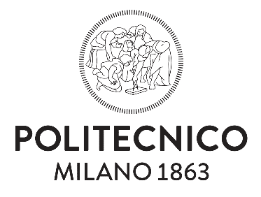

# Study Materials – Computer Science & Engineering

  

  

This repository is based on the **Computer Science and Engineering (T2A track)** at **Politecnico di Milano**, covering the academic years **2025–2027\***.

I had the honor of studying in this program, and this repository is my way of sharing some of the knowledge and experience I accumulated while navigating its academic challenges.

Some courses were supported by well-organized, dense, and high-quality materials, while others relied on a much more limited reservoir of shared resources. This imbalance motivated me to collect, organize, and share materials that personally helped me throughout my studies.

## 🎯 Purpose of This Repository

In this repository, you will find:

- Personal **study notes**
- **Exam samples** and example questions
- **Study techniques** and strategies that worked for me
- Additional materials accumulated during my Master’s studies
- Contributions and insights shared by peers (when permitted)

The goal is to support other students facing similar challenges and to contribute to a more accessible and collaborative academic environment.

## 🤝 Contributions & Collaboration

You are welcome to:

- Use these materials for your own studies
- Share them under the conditions described in the license

If you would like to contribute additional value — such as:
- corrections or comments  
- new notes  
- exam insights  
- or entire new subjects  

please feel free to contact me via email:

📧 **syao.yana@gmail.com**

## 📜 License & Usage Conditions

All materials in this repository are released under a **custom Academic Non-Commercial License**.

In short:

- ✅ Academic and personal study use is allowed  
- ❌ Commercial use is **not** allowed  
- ❌ No monetization of any kind  
- ❌ No data scraping or AI / machine-learning training  
- 🔁 Sharing is allowed **with attribution** and under the same license  

Please read the full license here:  
➡️ **[LICENSE](./LICENSE)**

## ⭐ Final Notes

If this repository helps you, consider:
- starring it ⭐
- sharing it with fellow students
- contributing back to improve it for others

## ⚠️ Disclaimer

This repository is **not an official resource** of Politecnico di Milano.

Some materials may reference or include third-party content used strictly for educational purposes. All rights remain with their respective authors. If you are a rights holder and believe content should be removed, please get in touch.
