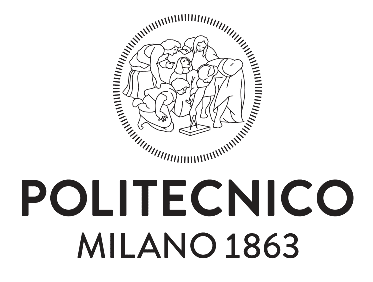

# Study Materials – Computer Science & Engineering

  

  

This repository is based on the **Computer Science and Engineering (T2A track)** at **Politecnico di Milano**, covering the academic years **2025–2027\***.

I had the honor of studying in this program, and this repository is my way of sharing some of the knowledge and experience I accumulated while navigating its academic challenges.

Some courses were supported by well-organized, dense, and high-quality materials, while others relied on a much more limited reservoir of shared resources. This imbalance motivated me to collect, organize, and share materials that personally helped me throughout my studies.

## 🎯 Purpose of This Repository

In this repository, you will find:

- Personal **study notes**
- **Exam samples** and example questions
- **Study techniques** and strategies that worked for me
- Additional materials accumulated during my Master’s studies
- Contributions and insights shared by peers (when permitted)

The goal is to support other students facing similar challenges and to contribute to a more accessible and collaborative academic environment.

## 🤝 Contributions & Collaboration

You are welcome to use these materials for your own studies, provided you respect the terms of the project license.

If you have notes, exam insights, or corrections you would like to share with the community, please reach out to me via email at syao.yana@gmail.com or in telegram via subject group chats.

#### Contribution Guidelines

Before submitting, please note the following policies:

- **Raw Materials Accepted**: I appreciate well structured and curated material, but you do not have to format your notes! I am happy to receive raw materials (e.g., rough notes, unformatted text, or summaries). I will use these to update the question banks or integrate them into my own study notes.

- **Intellectual Property:** If your submission directly incorporates a professor's slides, diagrams, or proprietary texts, **you must obtain their written permission** to share that content publicly. If the material requires professor permission, please include a copy or forward of their email approval along with your submission. 

- **Originality**: I strongly encourage you to adapt and personalize your notes. Submissions that are original summaries rather than direct copies of course material are prioritized, as they are more helpful for learning and avoid potential copyright issues.

- **Quality Control**: I reserve the right to decline, modify, or limit any information submitted to this page. My goal is to maintain a high-quality, truthful, and non-offensive resource for all students.

- **Attribution**: If your submission is accepted, please let me know if you would like to be credited by your real name, a nickname, or if you prefer to remain anonymous.

## 📜 License & Usage Conditions

All materials in this repository are released under a **custom Academic Non-Commercial License**.

In short:

- ✅ Academic and personal study use is allowed  
- ❌ Commercial use is **not** allowed  
- ❌ No monetization of any kind  
- ❌ No data scraping or AI / machine-learning training  
- 🔁 Sharing is allowed **with attribution** and under the same license  

Please read the full license here:  
➡️ **[LICENSE](./LICENSE)**

## ⭐ Final Notes

If this repository helps you, consider:
- starring it ⭐
- sharing it with fellow students
- contributing back to improve it for others

## ⚠️ Disclaimer

This repository is **not an official resource** of Politecnico di Milano.
While professors have kindly permitted the sharing of these practice concepts, they have not reviewed, checked, or verified any of the content in this repository. All solutions, explanations, and notes represent my personal study perspective and interpretation of the course material. They should not be treated as an official university answer key.

Some materials may reference or include third-party content used strictly for educational purposes. All rights remain with their respective authors. If you are a rights holder and believe content should be removed, please get in touch.
